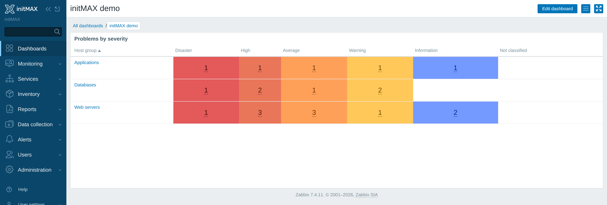
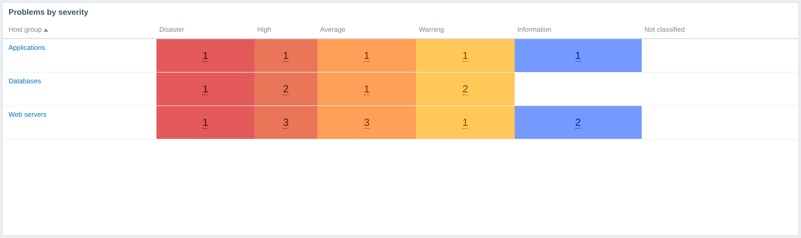
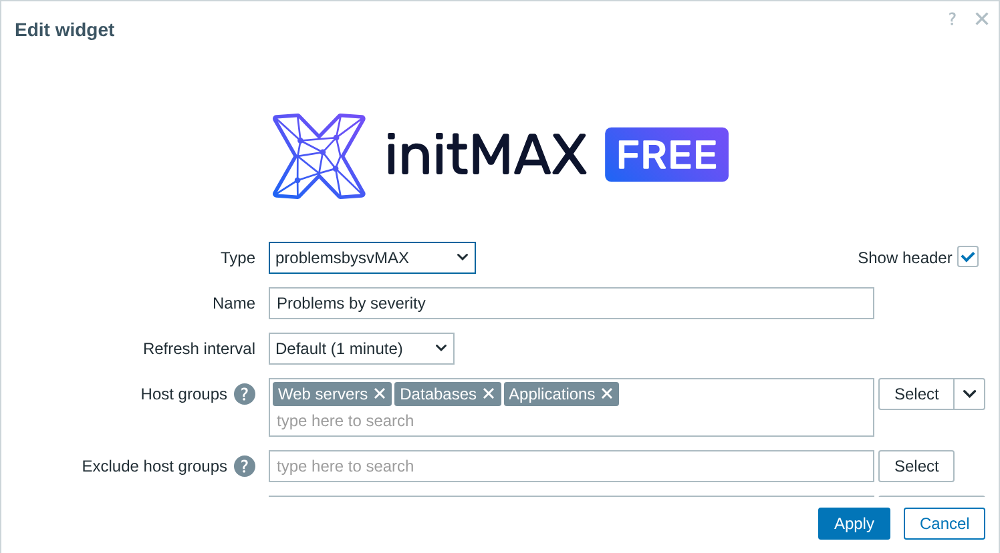
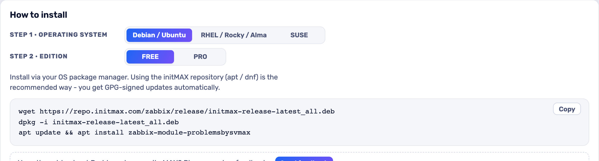

<h1>problemsbysvMAX</h1>

developed and maintained by

and community

<strong>Zabbix's Problems by severity, without the empty cells and with a counter you can actually read.</strong> 
Severities with no problems are left blank instead of painted, and the counter font size is yours to set - so a board on the wall stays legible from across the room.

<a href="#what-you-can-build"><strong>Features</strong></a> &nbsp;·&nbsp;
<a href="#examples"><strong>Examples</strong></a> &nbsp;·&nbsp;
<a href="#install"><strong>Install</strong></a> &nbsp;·&nbsp;
<a href="#free-vs-pro"><strong>FREE vs PRO</strong></a> &nbsp;·&nbsp;
<a href="https://portal.initmax.com"><strong>Portal</strong></a> &nbsp;·&nbsp;
<a href="https://www.initmax.com/wiki/problemsbysvmax/"><strong>Docs</strong></a>

 

---

## Why problemsbysvMAX

Zabbix's own "Problems by severity" paints a coloured cell for every severity, whether or not anything is wrong. On a wall board that means a permanent block of colour that says nothing, and counters sized for a laptop.

**problemsbysvMAX** is that widget with two changes customers asked for:

- a severity with **no problems is not painted at all**, so colour on the board always means something,
- the **counter font size is configurable** (10-64 px) together with the **cell padding** (0-50 px), so the number is readable at the distance the screen is actually viewed from and the row height follows.

## What you can build

<table>
<tr>
<td width="50%" valign="top">

**Only severities with problems**

Empty severities stay unpainted, so a green wall really means all is well.

</td>
<td width="50%" valign="top">

**Counter font size**

10 to 64 px - readable on a phone or on a 75-inch NOC screen.

</td>
</tr>
<tr>
<td width="50%" valign="top">

**Cell padding**

0 to 50 px, so the widget fits the tile you gave it.

</td>
<td width="50%" valign="top">

**Otherwise the stock widget**

Everything else works exactly like Zabbix's own Problems by severity.

</td>
</tr>
</table>

## Examples

<table>
<tr>
<td width="50%" align="center" valign="top"> <small><b>By severity</b> - by severity</small></td>
</tr>
</table>

## Configuration

Everything lives in one familiar widget form.

## Install

**FREE** ships as **GPG-signed `deb` / `rpm` packages** from the initMAX repository - `apt` / `dnf` installs them and keeps them updated.

### Easiest way - the guided installer on the Portal

Open the product page, pick your **OS** and **edition**, and copy the ready-made command. FREE is fully public (no login); PRO fills in your token once you sign in. There's a feedback box right there too.

<a href="https://portal.initmax.com/catalog/zabbix-problemsbysvmax#how-to-install"><strong>→ Open the installer on the Portal</strong></a>

Prefer a plain archive? Every release also ships as a **ZIP** [straight from the repo](https://repo.initmax.com/zabbix/free/zip/problemsbysvmax/) - handy for offline or manual installs.

The module is enabled automatically during the package installation - verify it in **Administration → General → Modules**. Done.

## FREE vs PRO

There is no paid edition. Everything above is in the FREE package, under AGPLv3.

| Feature | FREE |
| ---------------------------------------------------------- | :----: |
| Empty severity cells left unpainted | ✅ |
| Configurable counter font size (10-64 px) | ✅ |
| Configurable cell padding (0-50 px) | ✅ |
| Host groups and Totals layouts, both filters intact | ✅ |
| Every Zabbix filter of the original widget (severity, tags, problem name, suppressed, acknowledged) | ✅ |
| Localised into all 25 Zabbix display languages | ✅ |
| High availability ready | ✅ |
| Licence | AGPLv3 |

## Requirements

|              |                                                              |
| ------------ | ------------------------------------------------------------ |
| **Zabbix**   | 6.0 · 6.2 · 6.4 · 7.0 · 7.2 · 7.4 - one package covers all    |
| **PHP**      | 7.4 or newer                                                 |
| **OS**       | Debian/Ubuntu · RHEL/Rocky/Alma/Oracle/Amazon · SUSE         |
| **Editions** | FREE (public repo) - there is no paid edition                  |
| **Languages** | All 25 Zabbix display languages - the widget follows each user's own language setting |
| **High availability** | Ready. No server-side component and no local state - the widget reads the Zabbix database through the frontend like any other; install the package on every frontend node of an HA cluster and any node can serve it |

### One package, six Zabbix versions

Zabbix replaced its widget API in 6.4 and again in 7.0, and this widget is a fork of a core widget, so it inherits every one of those changes. The package therefore carries **two module trees** and the installer picks the right one for the frontend it finds - 6.0 and 6.2 get the legacy tree, 6.4 and newer get the modern one. Nothing to choose and nothing to configure.

The configuration dialog is deliberately the **same on all six**: same fields, same labels, same order. Two differences are the frontend's, not the widget's, and are listed here rather than papered over:

- **Widget communication is 7.0+.** Clicking a host-group row broadcasts that group to other widgets on the dashboard. Zabbix has no such mechanism before 7.0, so on 6.0-6.4 the row is simply not clickable; every count, filter and link is identical.
- **Template dashboards are 7.0+.** The "Override host" field belongs to Zabbix's template-dashboard support, which does not offer this widget type at all before 7.0. The control is left out there rather than rendered as a knob that does nothing.

## Support &amp; links

- **[Documentation / Wiki](https://www.initmax.com/wiki/problemsbysvmax/)**
- **[Product page](https://www.initmax.com/product/problemsbysvmax/)**
- **[Portal](https://portal.initmax.com)** - downloads, tokens, support tickets
- **Source code (FREE, AGPLv3)** - included in every package and published as a [source archive](https://repo.initmax.com/zabbix/free/zip/problemsbysvmax/) on repo.initmax.com
- **[support@initmax.com](mailto:support@initmax.com)**

---

FREE: <a href="https://www.gnu.org/licenses/agpl-3.0.html">AGPLv3</a> &nbsp;·&nbsp; © 2021-2026 initMAX s.r.o.

