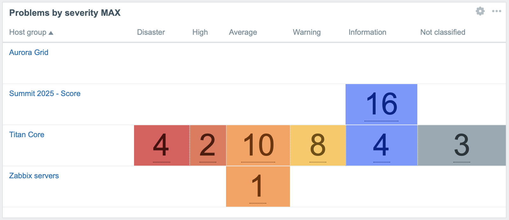
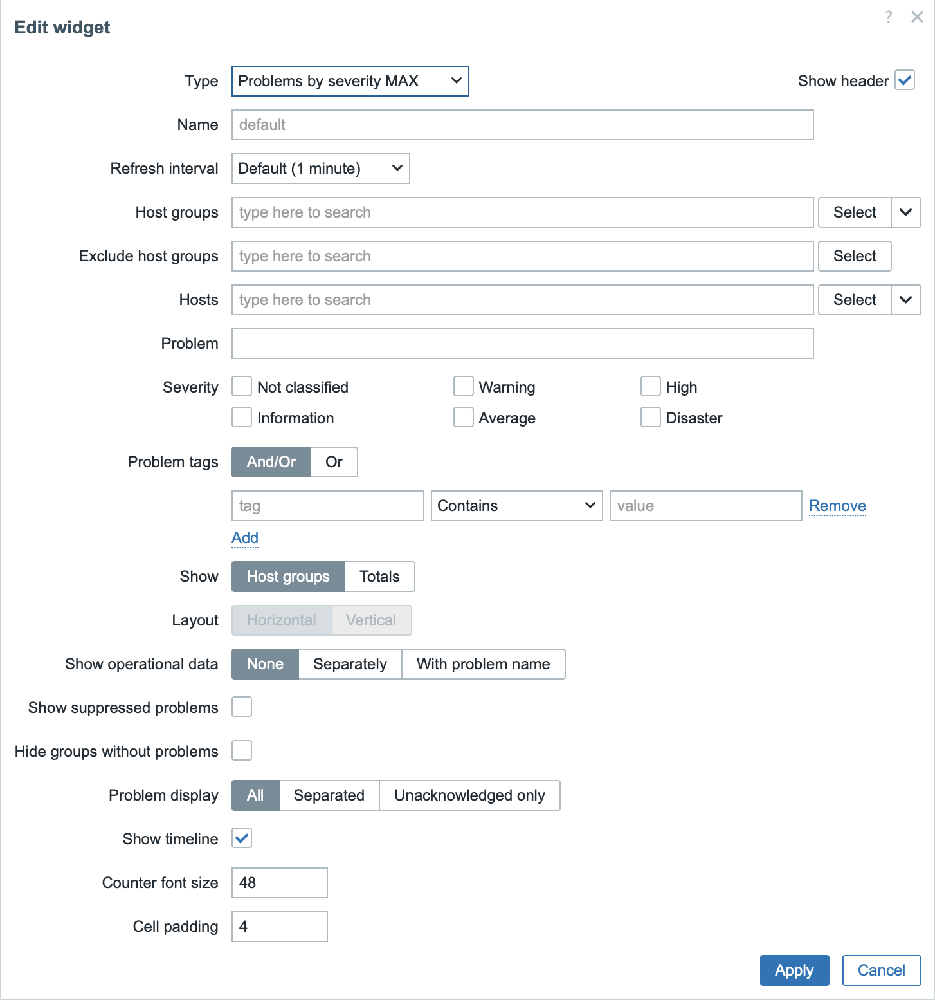

    
    <h3>
        
            Honesty, diligence and MAXimum knowledge of our products is our standard.
        
    </h3>
    <h3>
        &nbsp;&nbsp;&nbsp;
        &nbsp;&nbsp;&nbsp;
        &nbsp;&nbsp;&nbsp;
        &nbsp;&nbsp;&nbsp;
        &nbsp;&nbsp;&nbsp;
        
    </h3>

 

---
---

 
 

    <h1>
        Problems by severity MAX
    </h1>
    <h4><i>
        This widget extends features of the "Problems by severity" widget.
    </i></h4>
     
    
    
    <h3>
        <a href="#description">Description</a> •
        <a href="#configuration_page">Configuration page</a> •
        <a href="#installation">Installation</a>
    </h3>
     
    

 
 

## Description
This widget enhances the "Problems by severity" widget with improved visual clarity. Key features include:

- **Customizable Counter Font Size**: Adjust the font size of problem counters for better readability on large dashboards.
- **Customizable Cell Padding**: Control the padding around severity cells for a more compact or spacious layout.
- **Hidden Zero-Count Background**: Remove the background color from severity cells with a count of 0, resulting in a cleaner and less cluttered view.

 

<!-- *********************************************************************************************************************************** -->

## Configuration page

    

 

| Field                     | Description                                                                                      |
|---------------------------|--------------------------------------------------------------------------------------------------|
| **Counter font size**     | Set the font size (in pixels) of the problem count numbers displayed in severity cells.           |
| **Cell padding**          | Adjust the padding (in pixels) around severity cells for a more compact or spacious layout.       |

  

    <a href="https://www.initmax.com/wiki/problemsbysvmax/">
         
        <b>Documentation</b> 
        
    </a>

 
 

---
---

 

    <a href="https://www.initmax.com/">
         initMAX.com
    </a>&nbsp;&nbsp;&nbsp;
    <a href="tel:+420800244442">
         +420800244442
    </a>&nbsp;&nbsp;&nbsp;
    <a href="mailto:info@initmax.com">
         info@initmax.com
    </a>
       
    &nbsp;
    &nbsp;
    &nbsp;
    &nbsp;
    &nbsp;
       
    &nbsp;&nbsp;&nbsp;
    
       
    

